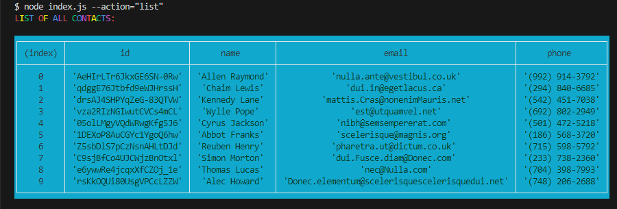
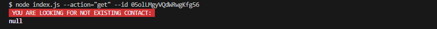
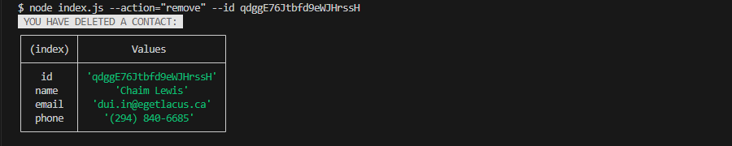
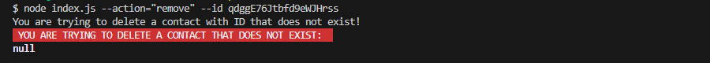
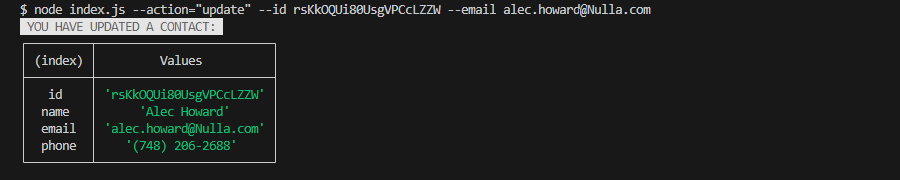
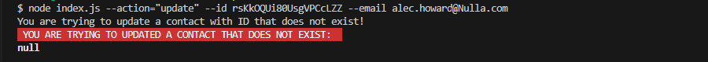

👉 [Скріншоти CLI](./README.md)
👉 [ДЗ](./HomeWorkTask.md)
👉 [Корисні матеріали](./INFO.md)

# CLI(Command line interface) програма.

## Команди та скріншоти їх виконання в терміналі

### Отримання всього списку контактів

Отримуємо і виводимо весь список контактів у вигляді таблиці (console.table).

```bash
node index.js --action="list"
```



### Пошук контакту по id

Отримуємо контакт по id і виводимо у консоль об'єкт контакту або null, якщо контакту з таким id не існує.

```bash
node index.js --action="get" --id 05olLMgyVQdWRwgKfg5J6
```




### Додавання контакту

Додаємо контакт та виводимо в консоль об'єкт новоствореного контакту.

```bash
node index.js --action="add" --name Mango --email mango@gmail.com --phone 322-22-22
```


### Видалення контакту

Видаляємо контакт та виводимо в консоль об'єкт видаленого контакту або null, якщо контакту з таким id не існує.

```bash
node index.js --action="remove" --id qdggE76Jtbfd9eWJHrssH
```





### Редагування контакту

Оновлюємо контакт та виводимо в консоль об'єкт видаленого контакту або null, якщо контакту з таким id не існує.

```bash
node index.js --action="update" --id rsKkOQUi80UsgVPCcLZZW --email alec.howard@Nulla.com
```





<!-- <p align="center">

</p> -->
